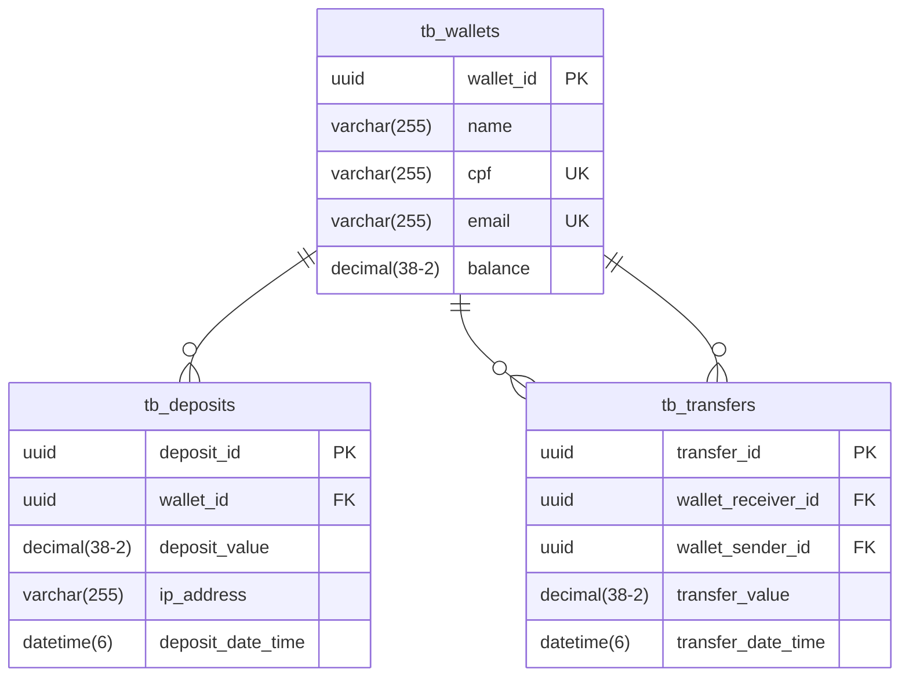

# Diagrama Entidade e Relacionamento

```mermaid
erDiagram
    tb_wallets {
        uuid wallet_id PK
        varchar(255) name
        varchar(255) cpf UK
        varchar(255) email UK
        decimal(38-2) balance
    }

    tb_deposits {
        uuid deposit_id PK
        uuid wallet_id FK
        decimal(38-2) deposit_value
        varchar(255) ip_address
        datetime(6) deposit_date_time
    }

    tb_transfers {
        uuid transfer_id PK
        uuid wallet_receiver_id FK
        uuid wallet_sender_id FK
        decimal(38-2) transfer_value
        datetime(6) transfer_date_time
    }

    %% Relacionamento: Uma carteira pode ter vários depósitos
    tb_wallets ||--o{ tb_deposits : ""

    %% Relacionamento: Uma carteira pode enviar várias transferências
    tb_wallets ||--o{ tb_transfers : ""

    %% Relacionamento: Uma carteira pode receber várias transferências
    tb_wallets ||--o{ tb_transfers : ""
```
